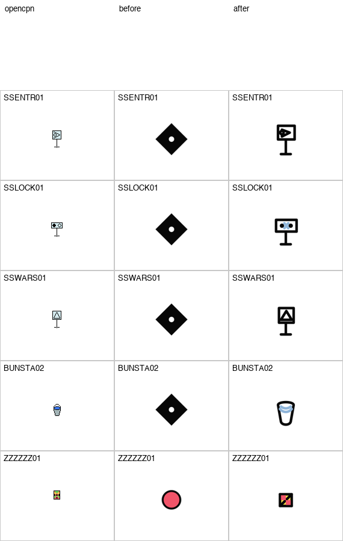

# Helm Icon Audit Mobile Index

Mobile-friendly entry point for the current Icon Forge audit reports and latest proof sheet.

## Current Reports

- [Helm icon style contract](helm_icon_style_contract.md)
- [Style audit](standard_style_audit.md)
- [Craft audit](standard_craft_audit.md)
- [Recognition judge queue](standard_recognition_judge_queue.md)
- [Repair queue](standard_repair_queue.md)
- [Source table summary](standard_source_table.md)

## Latest Batch Proof

## Current Snapshot

| Gate | Pass / Ready | Review / Notes | Blocked |
| --- | ---: | ---: | ---: |
| Style audit | 679 | 62 | 6 |
| Craft audit | 687 | 53 | 7 |
| Recognition queue | 611 | 113 | 23 |

Repair queue after batch 82: `25` rows remain.

## Notes

- These reports audit the current canonical Helm candidates, not every historical draft.
- Helm's house style is a thin OpenBridge-inspired `1.8` stroke, simple geometry, and no cartoon/doodle embellishment.
- The recognition queue packages Helm candidates, OpenCPN/S-101/AquaMap witnesses, semantic metadata, and style/craft audit status for the visual judge.
- Nothing in these reports means final approval; final signoff still requires visual judge and human approval.
